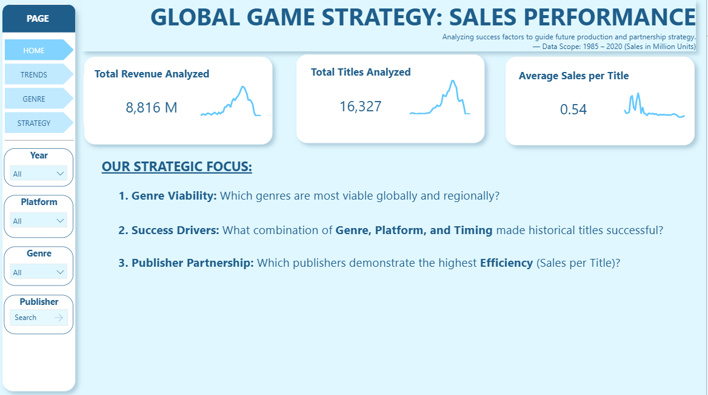
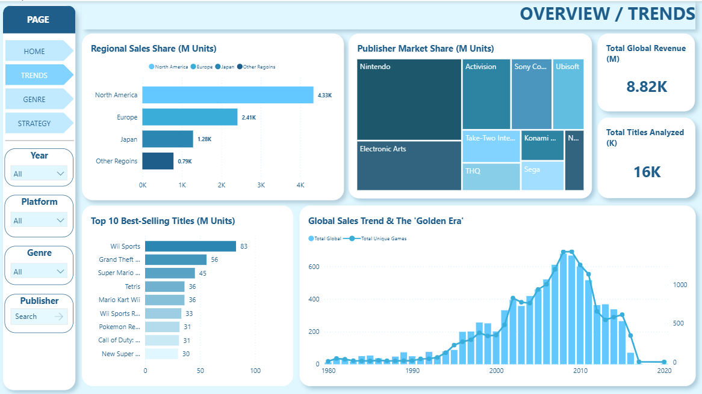
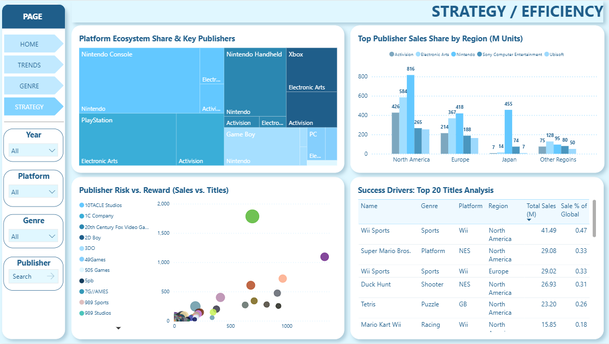

# 🎮 Video Game Sales Analysis (Power BI Project)

## 📘 Overview
This project explores the global video game market from 1980–2020 using data from Kaggle.  
It focuses on identifying sales patterns by **platform**, **genre**, **publisher**, and **region** to understand what drives success in the gaming industry.

---

## 📂 Dataset
- **Source:** Kaggle — “Video Game Sales with Ratings”
- **Size:** ~16,500 rows
- **Fields:** `Name`, `Platform`, `Year`, `Genre`, `Publisher`, `Global_Sales`, `NA_Sales`, `EU_Sales`, `JP_Sales`, `Other_Sales`

---

## 🔧 Data Cleaning & Transformation
Performed in Power Query and Python:
- Removed nulls and duplicates  
- Standardized year values  
- Created calculated columns for **Regional Share**  
- Grouped platform generations (e.g., PS2–PS4, Xbox–XOne)

---

## 🧩 Dashboard Pages

| Page | Description |
|------|--------------|
| **Home** | Overview of key metrics and global performance |
| **Trends** | Time-based sales trend by region |
| **Genre** | Comparison of platform performance and regional preferences |
| **Strategy** | Bubble chart with efficiency segmentation by publisher & genre |

---
## 🖥️ Dashboard

  

  

---

## 🧠 Key Insights
- **Wii Sports** and **Super Mario Bros** are the two best-selling games globally.
- **Nintendo** dominates the top charts with multiple high-performing titles.
- **North America** is the leading market in total game sales.
- **Action** and **Sports** are the most popular genres by total sales.
- However, when measuring **efficiency** (sales per title), **Platform** and **Shooter** genres outperform others — fewer games, but higher average sales.
- This suggests that focusing on **quality over quantity** can yield stronger commercial results for publishers. 

---

## 🧩 Tools & Techniques
| Category | Tool |
|-----------|------|
| EDA | Python |
| Data Cleaning | Excel, Power BI |
| Visualization | Power BI |
| Measures | DAX (AVERAGE, CALCULATE, FILTER, DIVIDE) |
| Dataset Source | Kaggle |

---

## 📎 Files Included
- `VideoGameSales.pbix` — Power BI Dashboard  
- `data_cleaning.ipynb` — Python cleaning script  
- `dax_measures.txt` — List of main DAX calculations  
- `/reports/screenshots/` — Dashboard preview images  

---

## 🧭 How to Use
1. Clone this repo or download the `.pbix` file  
2. Open in **Power BI Desktop**  
3. Interact with slicers (Year, Platform, Genre, Publisher)  
4. Explore insights per region and publisher  

---

## 🏁 Conclusion
This project demonstrates how data visualization helps identify business opportunities in the gaming industry —  
from **platform dominance** to **regional preferences** and **publisher efficiency**.

---

## 👩‍💻 Author
**[Đoàn Thị Kỳ Duyên](https://github.com/diencrazy)**  
📧 Email: [doanthikyduyen2001@gmail.com] 
